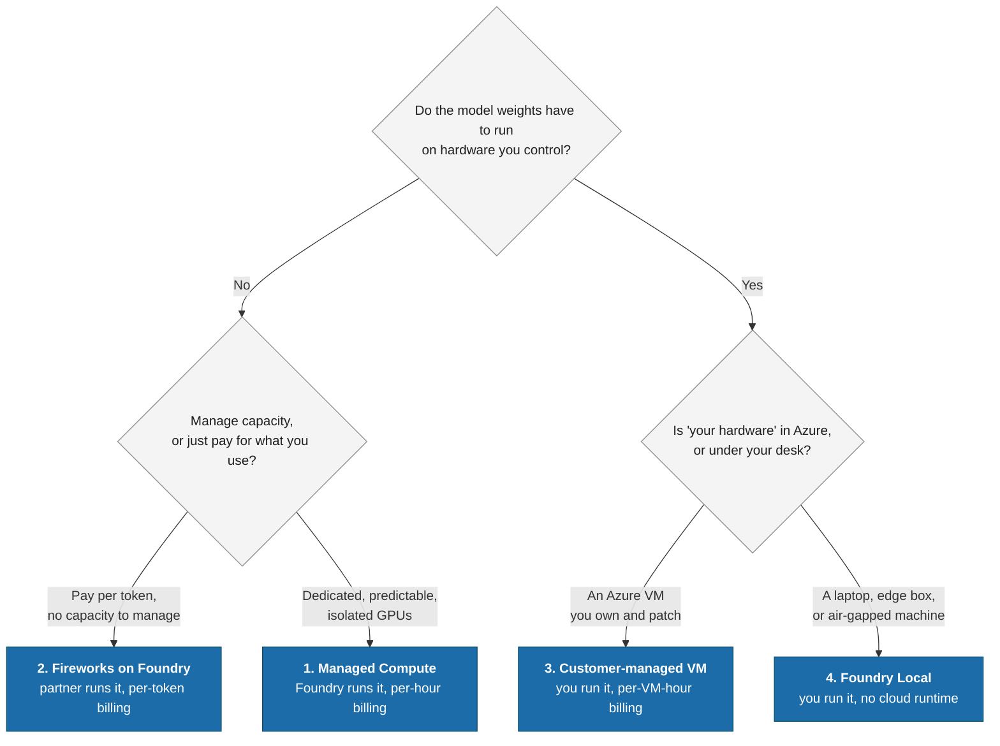
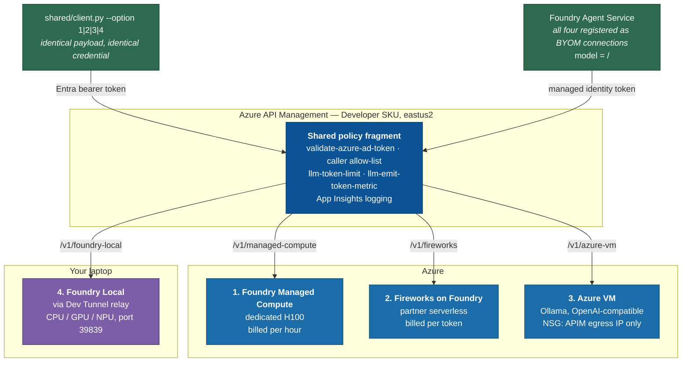
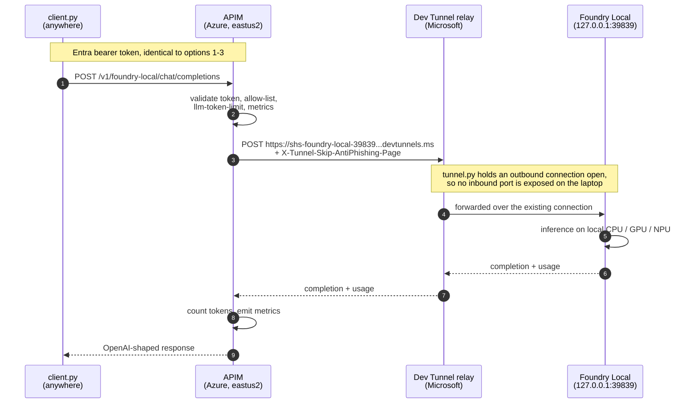
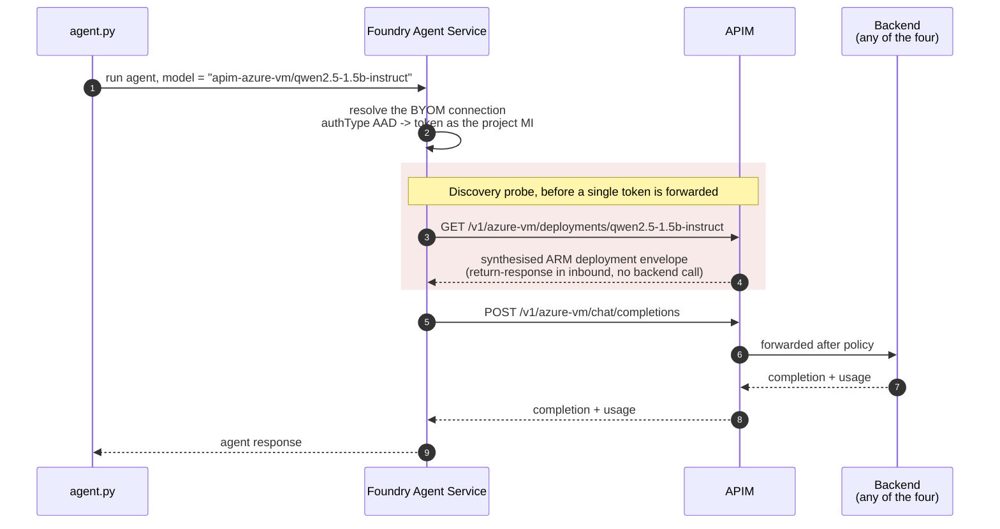

# self-hosting-spectrum

**Four ways to host a model on Azure. One API Management gateway. One client, one payload, four runtimes.**

This repository is a working demo *and* an implementation guide for the four model-hosting patterns in
*Microsoft — Self-hosted model options*. Each option hands a different amount of the runtime to the customer,
from "Foundry runs the GPUs for you" to "the model runs on your laptop". Every option is published through a
**single Azure API Management gateway** as an OpenAI-compatible `/chat/completions` route, so the same client
code and the same request body work against all four.

That is the whole point: **the hosting decision should not leak into your application code.**

Authentication is **keyless**. Every caller — a developer running the client, or a Foundry agent calling on its
own behalf — presents a Microsoft Entra token, and no shared secret is stored anywhere in the repository.

```console
$ uv run python shared/client.py --all

[1] Foundry Managed Compute      3512 ms    45 in / 62 out
[2] Fireworks on Foundry        19140 ms    34 in / 200 out
[3] Customer-managed Azure VM    4389 ms    45 in / 27 out
[4] Foundry Local                5557 ms    45 in / 18 out

4/4 options answered. Same client, same payload, four different runtimes.
```

---

## Table of contents

1. [The four options](#1-the-four-options)
2. [Architecture](#2-architecture)
3. [Prerequisites](#3-prerequisites)
4. [Quickstart](#4-quickstart)
5. [Per-option technical design](#5-per-option-technical-design)
6. [The APIM gateway layer](#6-the-apim-gateway-layer)
7. [Foundry Agent Service and Bring Your Own Model](#7-foundry-agent-service-and-bring-your-own-model)
8. [Demo script](#8-demo-script)
9. [Cost and teardown](#9-cost-and-teardown)
10. [Troubleshooting](#10-troubleshooting)
11. [References](#11-references)

---

## 1. The four options

| # | Option                              | Who owns the runtime   | Where it runs            | Billing                                              | Folder                                                  |
| - | ----------------------------------- | ---------------------- | ------------------------ | ---------------------------------------------------- | ------------------------------------------------------- |
| 1 | **Foundry Managed Compute**   | Microsoft Foundry      | Azure, dedicated GPUs    | **Per accelerator-hour**, even at zero traffic | [`01-managed-compute/`](01-managed-compute/)           |
| 2 | **Fireworks on Foundry**      | Fireworks AI (partner) | Azure, shared serverless | Per token                                            | [`02-fireworks-on-foundry/`](02-fireworks-on-foundry/) |
| 3 | **Customer-managed Azure VM** | You                    | Azure, a VM you own      | Per VM-hour                                          | [`03-azure-gpu-vm/`](03-azure-gpu-vm/)                 |
| 4 | **Foundry Local**             | You                    | Your own machine         | Free (your hardware)                                 | [`04-foundry-local/`](04-foundry-local/)               |

### One question decides it



The four rows are a spectrum of control versus operational burden. Moving down the table you gain control over
the weights, the runtime version, the kernel, and the physical location — and you take on capacity planning,
patching, scaling, and uptime. **Nothing above changes the API contract**, which is what this repo demonstrates.

---

## 2. Architecture



Everything terminates at one gateway, so authentication, rate limiting, token accounting, and logging are
written **once** and apply identically whether the model is on an H100 in Azure or an NPU in your laptop.

Note the two arrows into the gateway. A developer running `client.py` and a Foundry agent calling through a
BYOM connection present the *same kind* of credential — a Microsoft Entra token — and hit the *same* policy.
Neither holds a key.

### Repository layout

```text
self-hosting-spectrum/
├── README.md                      # this file - all prose lives here
├── LICENSE                        # MIT
├── pyproject.toml                 # uv workspace
├── infra/
│   ├── main.bicep                 # Foundry + APIM + VM + observability
│   ├── apis.bicep                 # the four APIM routes
│   ├── modules/                   # foundry, fireworks, apim, apim-apis, vm-inference, foundry-rbac
│   ├── policies/                  # fragment-llm-common.xml + one policy per route
│   └── scripts/                   # preflight, deploy, deploy_apis, setup_entra, teardown
├── 01-managed-compute/            # list_templates.py, deploy_managed_compute.py
├── 02-fireworks-on-foundry/       # list_models.py
├── 03-azure-gpu-vm/               # cloud-init.yaml, docker-compose.yml
├── 04-foundry-local/              # bootstrap.py, tunnel.py
└── shared/
    ├── config.py                  # the option → route table, single source of truth
    ├── auth.py                    # Entra token vs key, the only place auth is decided
    ├── client.py                  # --option 1|2|3|4, raw OpenAI call
    ├── agent.py                   # --option 1|2|3|4, Foundry BYOM prompt agent
    ├── register_connections.py    # register the routes as Foundry connections
    └── benchmark.py               # latency / tokens / cost per option
```

---

## 3. Prerequisites

| Tool              | Why                                                | Install                                   |
| ----------------- | -------------------------------------------------- | ----------------------------------------- |
| Azure CLI ≥ 2.60 | deployment and quota reads                         | `winget install Microsoft.AzureCLI`     |
| Bicep ≥ 0.30     | IaC                                                | `az bicep install`                      |
| `uv`            | **all** Python env and dependency management | `winget install astral-sh.uv`           |
| Foundry Local     | Option 4 runtime                                   | `winget install Microsoft.FoundryLocal` |
| Dev Tunnels CLI   | publishes Option 4 to the gateway                  | `winget install Microsoft.DevTunnel`    |

Azure permissions: **Contributor** plus **User Access Administrator** on the target subscription (the deployment
creates role assignments), and permission to create Foundry deployments.

```powershell
az login --tenant <your-tenant-id>
az account set --subscription <your-subscription-id>
```

Copy `.env.example` to `.env` and fill in the subscription and tenant. Everything else is written back into `.env`
by the deploy scripts.

---

## 4. Quickstart

**Step 0 — install dependencies.**

```powershell
uv sync
```

**Step 1 — preflight.** Checks the tenant, resource providers, the Fireworks feature flag, and managed compute quota
before anything is created.

```powershell
uv run python infra/scripts/preflight.py
```

**Step 2 — core infrastructure.** Creates the Foundry account and project, APIM, the VM, Log Analytics, and
Application Insights. Budget 30–45 minutes: an APIM Developer instance is slow to create the first time.

```powershell
uv run python infra/scripts/deploy.py
```

**Step 3 — publish the four routes onto the gateway.** Seconds, not minutes. Re-run it whenever a policy, a backend
URL, or the Dev Tunnel changes.

```powershell
uv run python infra/scripts/deploy_apis.py
```

**Step 4 — make the gateway keyless.** Resolves who is allowed to call it (you, via Azure CLI; and the Foundry
project's managed identity, for agents) and publishes the allow-list to APIM.

```powershell
uv run python infra/scripts/setup_entra.py
```

**Step 5 — cheapest end-to-end check.** Option 2 is billed per token, so this costs a fraction of a cent.

```powershell
uv run python shared/client.py --option 2
```

Options 1 and 4 need one extra step each.

**Option 4** — start the local runtime, then publish it through a Dev Tunnel. Leave `tunnel.py` running.

```powershell
uv run python 04-foundry-local/bootstrap.py
uv run python 04-foundry-local/tunnel.py
```

**Option 1** — the expensive one. Bring it up last and tear it down first.

```powershell
uv run python 01-managed-compute/list_templates.py
uv run python 01-managed-compute/deploy_managed_compute.py
```

Then run all four and compare:

```powershell
uv run python shared/client.py --all
```

---

## 5. Per-option technical design

Each section has the same shape so the four are directly comparable.

### Option 1 — Foundry Managed Compute

**Runtime owner:** Microsoft Foundry. You choose a model and an accelerator; Foundry runs the serving stack
(vLLM / SGLang / TRT-LLM depending on the template) on dedicated GPUs reserved for you.

**Azure resources**

| Resource                   | Type                                                                    |
| -------------------------- | ----------------------------------------------------------------------- |
| Foundry account            | `Microsoft.CognitiveServices/accounts@2025-06-01` kind `AIServices` |
| Managed compute deployment | `Microsoft.CognitiveServices/accounts/managedComputeDeployments`      |

> **There is no ARM/Bicep type for managed compute deployments yet.** They are created with the preview
> management SDK (`azure-mgmt-cognitiveservices==15.0.0b2`), which is why Option 1 is a Python script rather
> than a Bicep module.

**Endpoint:** *not* `/openai/v1`. Each managed compute deployment gets its own path, keyed by deployment name:

```text
https://<account>.cognitiveservices.azure.com/managed-deployments/<deployment-name>/v1/chat/completions
```

The create/get response reports it verbatim as `properties.routes.chatCompletionsScoringPath` — read it from
there rather than assembling it by hand, because it is the one part of this option that is easy to get wrong.
The body is natively OpenAI-shaped, no translation shim required, and `"model"` in the request is the
**deployment name**, not the catalog id. (The response `model` field echoes the real model, e.g.
`qwen--qwen3.6-27b-fp8`, which is a handy way to confirm you reached the right deployment.)

**Authentication:** Entra, audience `https://cognitiveservices.azure.com`. APIM's system-assigned managed
identity holds **Foundry User** and **Cognitive Services User** on the Foundry account, and the route policy
attaches a token via `authentication-managed-identity`.

> **"Azure AI User" was renamed to "Foundry User".** The role definition GUID is unchanged
> (`53ca6127-db72-4b80-b1b0-d745d6d5456d`), but `az role assignment create --role "Azure AI User"` now fails
> with *"Role doesn't exist"*. Some Learn pages still use the old name. **Assign by GUID**, which is what
> `infra/modules/foundry-rbac.bicep` does.

**The template is not optional.** This is the least obvious part of managed compute:

```text
model     = azureml://registries/azure-huggingface/models/qwen--qwen3.6-27b-fp8/versions/7
template  = azureml://registries/azure-huggingface/deploymenttemplates/
            qwen--qwen3-6-27b-fp8--256k-nvidia-h100/labels/latest
```

The **template**, not the model, decides the serving runtime, the context window, and which accelerator is legal.
Every model asset carries an `AllowedDeploymentTemplates` list, and:

* omit the template but set an accelerator → `DeploymentTemplate must be provided when AcceleratorType is specified`
* omit both → `model has no default deployment template (AllowedDeploymentTemplates) to fall back to`

Most `azureml`-registry models (including `Phi-4-mini-instruct`) have **no** managed-compute templates at all —
they are serverless assets. The deployable ones live in the **`azure-huggingface`** registry. There is no API that
lists templates; submit a create without one and read the error, or copy it from the model card in the portal.

The template above is FP8, and FP8 needs Hopper — so `A100_80GB` is illegal for it regardless of free quota. The
cheapest accelerator is not automatically the right one.

**Quota is a separate namespace.** Managed compute accelerator quota has nothing to do with VM or Azure ML GPU
quota — a subscription with **zero** GPU vCPU quota can still deploy here:

```console
$ uv run python 01-managed-compute/list_templates.py
  Accelerator     Scope       Used  Limit   Free
  A100_80GB       Global         0      8      8
  H100_80GB       Global         0      8      8
```

**Deploy / verify / delete**

| Step                           | Command                                                                 | Notes                               |
| ------------------------------ | ----------------------------------------------------------------------- | ----------------------------------- |
| Check quota and fleet capacity | `uv run python 01-managed-compute/list_templates.py`                  | Read-only, free                     |
| Create the deployment          | `uv run python 01-managed-compute/deploy_managed_compute.py`          | 10–25 min,**starts billing** |
| Verify through the gateway     | `uv run python shared/client.py --option 1`                           |                                     |
| Delete the deployment          | `uv run python 01-managed-compute/deploy_managed_compute.py --delete` | **Stops billing**             |

A deployment **cannot be deleted while it is still `Creating`** — the API returns
`RequestConflict: Another operation is in progress`. Wait for it to reach a terminal state, then delete.

**Cost:** ~$7.91 per H100 accelerator-hour (~$190/day), ~$3.67 for A100. **Billed while it exists, with zero
traffic.** This is the only option in this repo that can cost real money if you forget about it.

**Reasoning models return `content: null` if you starve them.** Both the Option 1 (Qwen3.6) and Option 2
(Fireworks) models can emit reasoning tokens before the answer. With a small `max_tokens` they hit the ceiling
mid-thought and return `finish_reason: "length"` with an empty `content` — which looks like a broken endpoint
but is not. Use `--max-tokens 1024` or more for these two.

---

### Option 2 — Fireworks on Foundry

**Runtime owner:** Fireworks AI, as a partner deployment inside your own Foundry account.

**Azure resources**

| Resource         | Type                                                                                                                                   |
| ---------------- | -------------------------------------------------------------------------------------------------------------------------------------- |
| Model deployment | `Microsoft.CognitiveServices/accounts/deployments` with `properties.model.format = 'Fireworks'`, `sku.name = 'DataZoneStandard'` |

This is **not** a Marketplace SaaS offer — no `az term accept`, no separate billing relationship. It is an
ordinary deployment resource, so it is plain Bicep ([`infra/modules/fireworks.bicep`](infra/modules/fireworks.bicep)).
One gate: the subscription feature **`Fireworks.EnableDeploy`** must be registered (preflight does this; allow
~30 minutes to propagate).

**Endpoint:** the same Foundry `/openai/v1` route as Option 1.

**Two gotchas that cost time**

1. **`model` in the request body is the *deployment* name, not the catalogue ID.** This repo names the
   deployment `fireworks`, so the body says `"model": "fireworks"` even though the catalogue entry is
   `FW-GLM-5.3-Flash`.
2. **Almost every small Fireworks model is provisioned-throughput only.** `FW-Llama-v3.1-8B-Instruct` and the
   other small models cannot be deployed pay-as-you-go at any price a demo would tolerate — they start at
   40 PTU. Run `uv run python 02-fireworks-on-foundry/list_models.py` to see which models actually offer
   `DataZoneStandard` / `GlobalStandard`.

The default here is **`FW-GLM-5.3-Flash`**, a currently GA pay-as-you-go chat model. Fireworks' serverless
catalog changes frequently, so run `list_models.py` before deployment and verify current pricing in Foundry.
It is a **reasoning** model — it may emit reasoning tokens, so give it enough `max_tokens` (the client defaults
to 512) or the answer gets truncated mid-thought.

> Per-token Fireworks models carry only a **15-day retirement notice**. The model name is a Bicep parameter for
> exactly this reason. Pay-as-you-go is **US regions only**, and Fireworks is outside the EU Data Boundary.

**`sku.capacity` is a rate limit, not a bill.** `DataZoneStandard` charges per token, so capacity only sets the
throttle ceiling — and the default of `1` means literally **one request per minute**. Back-to-back calls
(`benchmark.py`, `client.py --all`) then fail with `HTTP 429 RateLimitReached`, which reads like an APIM problem
but comes from the Fireworks deployment. This repo sets `capacity = 50`; raising it does not raise the cost.

**Verify**

```powershell
uv run python 02-fireworks-on-foundry/list_models.py
uv run python shared/client.py --option 2
```

---

### Option 3 — Customer-managed Azure VM

**Runtime owner:** you. Azure provides the VM; everything above the hypervisor is yours to choose, patch, and
scale.

**Azure resources:** VNet + subnet, NSG, public IP, NIC, and a Linux VM
([`infra/modules/vm-inference.bicep`](infra/modules/vm-inference.bicep)). `vmSize` and `runtime` are parameters,
so the same module serves a CPU box today and a GPU box after a quota increase:

| `runtime` | Good for        | Notes                                                  |
| ----------- | --------------- | ------------------------------------------------------ |
| `ollama`  | CPU, or any GPU | Default. Simple, OpenAI-compatible, single binary      |
| `vllm`    | GPU only        | Continuous batching, much better multi-user throughput |

The default is **`Standard_D4s_v7` + Ollama + `qwen2.5:1.5b-instruct`**, which needs **no GPU quota at all** and
costs about **$0.19/hour**. If you do request GPU quota, ask for **`NCASv3_T4`** (T4, ~$0.53/hr) rather than
`NCSv3` — the V100 in `NC6s_v3` is SM70, which current vLLM has dropped, and it costs ~6× more for a worse
experience.

**Serving is configured by cloud-init** ([`03-azure-gpu-vm/cloud-init.yaml`](03-azure-gpu-vm/cloud-init.yaml)),
which installs the runtime, pulls the model, and warms it so the first gateway call is not a cold start.

> **cloud-init runs with no `$HOME`.** The `ollama` *CLI* panics with `$HOME is not defined` while the *daemon*
> is unaffected — so `systemctl status` is green, the port is listening, and every inference returns 500 because
> no model was ever pulled. `export HOME=/root` first. This failure mode is silent and cost real debugging time.

**Network boundary.** The inference port is never open to the internet. The NSG admits exactly one source:

```bicep
sourceAddressPrefixes: apimOutboundIpAddresses   // e.g. [ '135.18.171.17' ]
```

> **Do not use the `ApiManagement` service tag here.** It covers APIM's *inbound management* endpoints, not the
> address a gateway calls a backend from. It looks correct, deploys cleanly, and then every request times out and
> surfaces as a bare `HTTP 500`. A non-VNet-injected APIM egresses from its own instance public IP, which
> `infra/modules/apim.bicep` publishes as the `outboundIpAddresses` output. Note that
> `az apim show --query publicIPAddresses` returns `null` — read `properties.publicIPAddresses` from the raw ARM
> GET instead.

**Verify**

Through the gateway:

```powershell
uv run python shared/client.py --option 3
```

On the VM itself, bypassing the gateway — useful for deciding whether a failure is the model or the network path:

```powershell
az vm run-command invoke -g rg-self-hosting-spectrum -n vm-inference-shs01 `
  --command-id RunShellScript --scripts "curl -s localhost:11434/v1/models"
```


#### Optional remote desktop access

Option 3 runs **Ubuntu**, not Windows. It is provisioned with an SSH public key, so there is no initial
password to retrieve. For an optional graphical administration session, install XFCE and xrdp:

```powershell
az vm run-command invoke -g rg-self-hosting-spectrum -n vm-inference-shs01 `
  --command-id RunShellScript --scripts 'set -eu; export DEBIAN_FRONTEND=noninteractive NEEDRESTART_MODE=l; apt-get update -qq; apt-get install -y -qq --no-install-recommends xfce4 xfce4-terminal xrdp xorgxrdp dbus-x11; adduser xrdp ssl-cert; echo startxfce4 > /home/azureuser/.xsession; chown azureuser:azureuser /home/azureuser/.xsession; chmod 600 /home/azureuser/.xsession; systemctl enable xrdp; systemctl restart xrdp'

# Restrict RDP to your current public IP, never 0.0.0.0/0.
$adminIp = (Invoke-RestMethod -Uri ("https://api.ipify.org?nocache=" + [guid]::NewGuid())).Trim()
az network nsg rule create -g rg-self-hosting-spectrum --nsg-name nsg-inference-shs01 `
  -n allow-rdp-admin --priority 110 --direction Inbound --access Allow --protocol Tcp `
  --source-address-prefixes "$adminIp/32" --source-port-ranges '*' `
  --destination-address-prefixes '*' --destination-port-ranges 3389
```

If you changed the deployment's admin username, replace `azureuser` in the desktop setup command.
Set a password yourself through **Azure Portal > VM > Help > Reset password**, selecting **Reset password**
for your existing admin user. Do not put passwords in scripts, `.env`, or Git. Open Windows **Remote Desktop
Connection**, connect to the VM's public DNS name on port `3389`, select **Xorg** at the xrdp login screen,
and use that username and the password you just set. This is local Linux account authentication, not Entra login.

This optional setup is applied to the existing VM, not enabled by the default Bicep deployment. Recreating
the VM or redeploying its NSG can require reapplying it. Update the IP restriction if your public IP changes.
For production, prefer private administration through VPN or an appropriately configured Azure Bastion.


---

### Option 4 — Foundry Local

**Runtime owner:** you, on hardware you can physically touch. No cloud runtime dependency for the inference
itself.

**Runtime:** Foundry Local runs the model on native CPU, GPU, or NPU via ONNX Runtime.

```powershell
uv run python 04-foundry-local/bootstrap.py
```

That script encodes three things that are easy to get wrong:

1. **Pin the port.** `foundry server start` picks a *random* port by default. The bootstrap always starts it on
   `39839` with `--idle-timeout 0` so the tunnel and the APIM backend URL stay valid.
2. **The alias is not the served model id.** The catalogue alias `qwen2.5-0.5b` is served as a *hardware
   variant* — on a machine with an NPU that is `qwen2.5-0.5b-instruct-openvino-npu`, on a plain CPU box it is
   `qwen2.5-0.5b-instruct-generic-cpu`. The variant id is what must appear in the request body, so the script
   resolves it from `/v1/models` (matching on the `parent` field, which carries the alias).
3. **Cached is not loaded.** `/v1/models` lists models present *on disk*. Asking one that is not resident for a
   completion returns `HTTP 400 "Model … is not loaded"`, which reads like a malformed request rather than a
   missing warm-up step. The script runs `foundry model load` before smoke-testing.

Foundry Local returns a proper `usage` object, so the gateway's token policies count it exactly like a cloud
backend.

#### Reaching a laptop from a gateway in Azure

Options 1–3 have backends in Azure, so the gateway calls them directly. Option 4 does not: Foundry Local listens
on `http://127.0.0.1:39839` on your machine, which Azure cannot route to. There are two real answers.

|                     | **A. APIM self-hosted gateway**                                                                                  | **B. Dev Tunnel — used here**                                                          |
| ------------------- | ---------------------------------------------------------------------------------------------------------------------- | --------------------------------------------------------------------------------------------- |
| What it is          | APIM's*data plane* as a Docker container you run locally; it syncs policy from Azure and executes it on your machine | A CLI that opens an outbound connection to a Microsoft relay and publishes a stable HTTPS URL |
| Runs on the laptop  | Docker container, ~1 GB RAM                                                                                            | Small CLI, negligible                                                                         |
| APIM SKU required   | **Developer or Premium only**                                                                                    | Any                                                                                           |
| Inference traffic   | **never leaves the machine**                                                                                     | laptop → relay → Azure → relay → laptop                                                   |
| Rate-limit counters | local, do not aggregate with the cloud gateway                                                                         | single cloud gateway, counters aggregate                                                      |
| Use it when         | data residency, sovereignty, or air-gap requirements                                                                   | proving a local model works as a gateway-fronted backend                                      |

APIM is split into a **control plane** (APIs, policies, keys, metrics — always in Azure) and a **data plane**
(the process that receives a request, executes the policy XML, and calls the backend). Option A moves the data
plane onto your machine; Option B leaves it in Azure and moves the *network path* instead.

**This repo uses B**, because the goal is to show a local model behaving like any other gateway backend, not to
prove data residency. If your requirement *is* data residency, use A — the policies in `infra/policies/` work
unchanged.



Start the tunnel and leave it running:

```powershell
uv run python 04-foundry-local/tunnel.py
```

The tunnel is **persistent and named** (`shs-foundry-local`) so its URL survives restarts, and the script pushes
that URL into the APIM named value `foundry-local-backend-url` — so re-pointing the gateway at a new tunnel is
one command, not a redeployment.

> `devtunnel show <id>` takes **`-j` / `--json`** (not `-o json`). Use the hosted port's **`portUri`**
> as the authoritative public URL; it can contain an opaque hostname, so do not derive it from the tunnel id.
> `tunnel.py` discovers the URL and updates APIM automatically. Wait for **`Option 4 is live`** before calling the client.

> Dev Tunnels serve an **anti-phishing interstitial** to browser-shaped requests, which returns HTML where your
> client expects JSON. `infra/policies/foundry-local.xml` sets `X-Tunnel-Skip-AntiPhishing-Page: true` at the
> gateway, so no client ever has to know.

> The tunnel is anonymous-access: the URL is unguessable but public, and it expires after 30 days.
> **APIM remains the real auth boundary.** Foundry Local itself has no authentication, so never publish it
> without a gateway in front.

---

## 6. The APIM gateway layer

One shared policy fragment, [`infra/policies/fragment-llm-common.xml`](infra/policies/fragment-llm-common.xml),
is included by all four routes.

### Why `llm-*` and not `azure-openai-*`

The `azure-openai-*` policies were **consolidated into `llm-*`**. The `llm-*` policies are **schema-gated, not
provider-gated**: they work against any backend that speaks the OpenAI chat-completions schema. That is the
technical reason one fragment can front a Fireworks partner deployment, an Ollama process on a VM, and an ONNX
model on a laptop NPU without a single conditional.

### What the fragment does

**1. Inbound authentication - keyless by default.** The gateway validates a Microsoft Entra token. No shared
secret exists anywhere in the repository: `az login` is the developer's credential, and a managed identity is
the agent's.

```xml
<validate-azure-ad-token
  tenant-id="{{spectrum-tenant-id}}"
  header-name="Authorization"
  output-token-variable-name="jwt">
  <audiences>
    <audience>{{spectrum-entra-audience}}</audience>
    <audience>{{spectrum-entra-audience-alt}}</audience>
  </audiences>
</validate-azure-ad-token>
```

The audience is listed twice on purpose. `validate-azure-ad-token` compares the `aud` claim as an exact
string, and both spellings of this resource are in circulation: Azure CLI issues tokens for
`https://cognitiveservices.azure.com` with no trailing slash, while several SDKs and the Foundry connection's
**Audience** field are commonly configured with one. Bicep derives the second named value from the first, so
the pair can never drift, and an entire class of silent `401` disappears.

Two very different callers present the same kind of token to the same policy:

| Caller                                              | Identity                                               | Application ID in the`appid` claim         |
| --------------------------------------------------- | ------------------------------------------------------ | -------------------------------------------- |
| `client.py`, `benchmark.py`, run by a developer | the human, via`az login`                             | Azure CLI's first-party app,`04b07795-...` |
| A Foundry agent calling through a BYOM connection   | the Foundry project's system-assigned managed identity | discovered by`setup_entra.py`              |

[`infra/scripts/setup_entra.py`](infra/scripts/setup_entra.py) resolves both and writes them into a single APIM
named value, so changing who may call the gateway is a named-value update rather than a policy redeployment.

> **Why check the claim instead of using `client-application-ids`?** `validate-azure-ad-token` does have that
> element, but it takes one literal `<application-id>` child per ID, and a named value cannot expand into
> several elements. Reading the claim in a `<choose>` keeps the whole list in one updatable value. An empty
> list means *any caller in the tenant holding a valid token for the audience*, so an unset value degrades to
> the documented default instead of locking everybody out.

> **Object ID is not application ID.** ARM hands back the managed identity's *object* ID; the token carries its
> *application* ID. Mixing them up produces a `403` that looks exactly like a broken policy.
> `az ad sp show --id <object-id>` is the bridge, and `setup_entra.py` does it for you.

**2. Key mode, for migrations.** Setting `GATEWAY_AUTH_MODE=key` swaps the block above for a subscription-key
check. It exists because most real deployments start there, and the point of the demo is that moving off keys is
a configuration change rather than a rewrite. APIM validates its own subscription key *before any policy runs*,
so a policy cannot rescue a client that sends the key somewhere unexpected. The APIs are therefore declared
`subscriptionRequired: false` and the fragment does the check itself, accepting every shape a real client uses:
`Ocp-Apim-Subscription-Key` for APIM-native clients and `curl`, `api-key` for the Azure OpenAI SDK, the
`Authorization` header for the OpenAI SDK (which cannot be told to do anything else), and a `?subscription-key=`
query parameter for browsers and quick links.

Either way, **one unmodified OpenAI SDK client reaches all four routes**. In Entra mode the token is handed to
the SDK as its `api_key`, because the SDK's only job with that value is to send it as a bearer token, which is
exactly the header `validate-azure-ad-token` reads. The keyless path therefore needs no custom transport and no
branch in [`shared/client.py`](shared/client.py).

**3. Credential stripping.** All inbound credential headers are deleted before the request leaves the gateway,
and each route then attaches its own backend credential. A token or key that is valid at the gateway is never
replayed against Foundry, the VM, or your laptop.

**4. Token budget.**

```xml
<llm-token-limit
  counter-key="@(context.Api.Id)"
  tokens-per-minute="{{spectrum-tokens-per-minute}}"
  estimate-prompt-tokens="false"
  tokens-consumed-header-name="x-shs-tokens-consumed"
  remaining-tokens-header-name="x-shs-tokens-remaining" />
```

The counter is keyed **per API**, so hammering one option cannot starve the other three — which makes the limit
demonstrable rather than theoretical. `estimate-prompt-tokens="false"` reads real counts from the response
`usage` object instead of guessing from the prompt: more accurate, but the limit applies *after* the offending
call rather than before it.

**5. Token metrics.**

```xml
<llm-emit-token-metric namespace="self-hosting-spectrum">
  <dimension name="ApiId" value="@(context.Api.Id)" />
  <dimension name="Option" value="@(context.Request.Headers.GetValueOrDefault("x-shs-option", "unknown"))" />
</llm-emit-token-metric>
```

Splitting by `ApiId` in App Insights puts cost and latency for all four hosting patterns on one chart.

> Both `llm-token-limit` and `llm-emit-token-metric` accept **named values** (`{{...}}`) for their numeric
> attributes and dimension expressions — so limits are tunable without redeploying policy.

### Token counting caveat

Token policies need a `usage` object in the response. All four backends here return one for non-streamed calls,
so counts are exact. **For streamed calls the client must send `stream_options: {"include_usage": true}`** or
the numbers become estimates.

### Managed identity is scoped per API, never globally

`authentication-managed-identity` is applied only on the two Foundry-backed routes. A global version would
attach a Cognitive Services token to requests bound for your VM and your laptop — leaking an Azure credential
to backends that have no business seeing it.

### Writing policy XML

Two traps, both of which fail at deploy time with confusing messages:

* **A literal `<` in text content is parsed as a tag.** A 401 body containing `Authorization: Bearer <key>`
  produces `The 'key' start tag ... does not match the end tag of 'set-body'`. Use `[key]` or `&lt;key&gt;`.
  Note that double quotes *inside* an `@(...)` expression are fine — policy XML is deliberately lenient there,
  which makes this asymmetry surprising.
* Prefer `(string)context.Variables["x"]` over `context.Variables.GetValueOrDefault<string>("x", …)` — the
  generic's angle brackets are needless risk inside an XML attribute.

---

## 7. Foundry Agent Service and Bring Your Own Model

Foundry Agent Service used to require an Azure OpenAI deployment. It now accepts **any** OpenAI-compatible
endpoint through the connection categories **`ApiManagement`** and **`ModelGateway`** — so all four options
become real Foundry agents, not just the cloud ones.

Register the four connections (`apim-managed-compute`, `apim-fireworks`, `apim-azure-vm`, `apim-foundry-local`),
then run an agent against any of them:

```powershell
uv run python shared/register_connections.py
uv run python shared/agent.py --option 4
```

Three details decide whether this works:

1. **Foundry appends `chat/completions` to the connection target.** Register
   `https://<apim>.azure-api.net/v1/azure-vm/` and you get exactly the route this repo publishes. Leave
   *"Include deployment name in URL path"* **disabled** — that is `deploymentInPath: "false"` in the
   connection metadata, and it is **not** optional: a connection without it fails validation.
2. **The agent references the model as `<connection-name>/<model-name>`** — e.g.
   `apim-azure-vm/qwen2.5-1.5b-instruct`. [`shared/config.py`](shared/config.py) owns both halves so nothing
   else has to guess.
3. **The connection stores no secret.** It is registered with `authType: "AAD"` and an empty credentials
   object, so Foundry calls the gateway as the **project's own system-assigned managed identity** and Entra
   mints a token per request. `setup_entra.py` puts that identity's application ID on the gateway's allow-list.
   Setting `GATEWAY_AUTH_MODE=key` registers key-based connections instead, for comparison.

#### The gateway has to answer a discovery probe

This is undocumented and it is the single hardest thing to work out from the error messages.



Before Foundry forwards a single token, its model gateway **validates the deployment** by calling
`GET <connection-target>/deployments/<model-name>`. A route that only publishes `/chat/completions` returns 404
and the agent fails with:

```text
Model gateway error: Upstream gateway returned NotFound
```

which says nothing about a probe. The only way to see what actually happened is App Insights:

```kusto
requests | where timestamp > ago(15m) | project timestamp, name, url, resultCode | order by timestamp desc
```

That shows the real request — `GET /v1/managed-compute/deployments/probe-x → 404`.

Answer it and the error advances to a second, equally opaque one:

```text
Model gateway error: Failed to parse deployment response for '<model>' from provider 'AzureOpenAI'
```

Foundry treats an `ApiManagement` connection as an **AzureOpenAI provider**, so it wants the **ARM control-plane
deployment envelope** — `name`, `properties.model.{format,name,version}`, `properties.provisioningState`,
`sku` — not the flat data-plane `{id, object, model, status}` shape. Note also that this Foundry account does
**not** serve the legacy `/openai/deployments?api-version=2023-05-15` discovery route (it 404s), so you cannot
copy the shape from the live account's data plane; read it from ARM instead:

```powershell
az rest --method get --url "https://management.azure.com/subscriptions/<sub>/resourceGroups/<rg>/providers/Microsoft.CognitiveServices/accounts/<acct>/deployments/fireworks?api-version=2024-10-01"
```

There is no real deployment behind Options 3 and 4, so the gateway **synthesises** the descriptor entirely in
policy — see [`infra/policies/operation-get-deployment.xml`](infra/policies/operation-get-deployment.xml). It is
a `<return-response>` in `<inbound>`, so no backend is contacted. It emits a superset of both shapes, which
costs nothing and satisfies either reader. All four APIs get the operation, including the two that do have real
deployments, so the four routes stay identical.

**Two more rules Foundry enforces on the model name**

* **No colons.** `Deployment name contains invalid characters. Only alphanumeric, dots, hyphens, and underscores allowed.` Ollama's `name:tag` convention always has one, so `cloud-init.yaml` publishes a colon-free alias
  (`ollama cp qwen2.5:1.5b-instruct qwen2.5-1.5b-instruct`).
* **The Responses API property is `agent_reference`, not `agent`.** Using `agent` returns
  `invalid_payload: The 'agent' property is deprecated.`

**Creating an agent needs a data-plane role.** Subscription **Contributor is not enough** — it does not grant
`Microsoft.CognitiveServices/accounts/AIServices/agents/write`, and you get a 403. Assign **Foundry User**
(GUID `53ca6127-db72-4b80-b1b0-d745d6d5456d`) plus **Cognitive Services User** to the developer principal;
`infra/main.bicep` takes a `developerPrincipalId` parameter for this. Allow a few minutes for propagation.

**Limits:** BYOM works with **prompt agents** and requires `azure-ai-projects >= 2.0.0`.

> **Responsible AI:** BYOM models are Non-Microsoft Products. Azure's built-in content filters **do not apply**,
> and you own the mitigations. That is the argument for putting `llm-content-safety` in the gateway policy
> rather than trusting four different backends to behave.

---

## 8. Demo script

The strongest 45-minute story is **not** to deploy resources live. APIM can take 30–45 minutes to provision and
Managed Compute usually takes another 10–25 minutes. Pre-stage every backend, then use the meeting to show the
architecture, the deployed resources, the four APIM APIs, and four successful calls.

### Before the audience joins

Run this at least 45 minutes before the meeting:

```powershell
uv run python infra/scripts/preflight.py
uv run python 01-managed-compute/deploy_managed_compute.py --status
uv run python 04-foundry-local/bootstrap.py --status
```

If the Option 3 VM was deallocated after the previous session, start it and allow several minutes for Ollama:

```powershell
az vm start -g rg-self-hosting-spectrum -n vm-inference-shs01
```

Start Option 4 in two terminals. The first command prepares and smoke-tests the model; the second command must
remain running for the whole demonstration:

```powershell
# Terminal 1
uv run python 04-foundry-local/bootstrap.py

# Terminal 2 - leave this process running
uv run python 04-foundry-local/tunnel.py
```

Finally, prove every route before screen sharing:

```powershell
uv run python shared/client.py --all --prompt "In one sentence, explain where this model is running."
```

Do not continue until this reports `4/4` successful calls. Keep a terminal with the commands below already
typed, and close unrelated portal tabs and notifications.

### The 45-minute walkthrough

| Time | Show | What to say |
| ---- | ---- | ----------- |
| 0–7 min | The architecture Mermaid diagram in [§2](#2-architecture) | “One client sends one OpenAI-compatible payload through one keyless APIM gateway. Only the runtime owner and location change.” |
| 7–12 min | The four rows in [§1](#1-the-four-options) | Option 1 is dedicated Foundry-managed capacity; Option 2 is partner serverless; Option 3 is a VM and runtime we operate; Option 4 is this laptop. |
| 12–18 min | Azure resource group `rg-self-hosting-spectrum` | Point out Foundry, APIM, the VM, networking, and observability. Foundry Local is intentionally absent because it runs on the laptop. |
| 18–23 min | APIM → APIs | Show the four `/v1/...` APIs and the common `POST /chat/completions` operation. Open one inbound policy and point out Entra validation, rate limiting, routing, and token metrics. |
| 23–35 min | Four client calls, Options 1 through 4 | For each result, point to `runtime owner`, `runs on`, `route`, `model`, latency, token counts, and answer. The client code and prompt never change. |
| 35–40 min | One `--all` call | This is the portability proof: four backends answer in one comparison table through the same gateway and credential. |
| 40–45 min | Summary, questions, and cleanup | “The four options differ in who owns the runtime, not in how the application calls it.” Delete Managed Compute immediately after the final question. |

### Show the Azure deployments

Use the portal for visual clarity: open **Resource groups → `rg-self-hosting-spectrum` → Resources**. Keep this
CLI fallback ready if the portal is slow:

```powershell
az resource list -g rg-self-hosting-spectrum `
  --query "[].{Name:name, Type:type, Location:location}" -o table
```

Then show the resources unique to each pattern:

1. **Option 1:** Foundry account → Models + endpoints → Managed Compute deployment.
2. **Option 2:** Foundry account → Models + endpoints → Fireworks deployment.
3. **Option 3:** `vm-inference-shs01`, its public IP, and the NSG restricted to APIM outbound addresses.
4. **Option 4:** the `bootstrap.py` smoke-test output and the live Dev Tunnel terminal. It should not appear as
   an Azure compute resource.

### Show the four APIM APIs

Open **API Management → APIs** and select each API. The URL suffixes must be:

```text
v1/managed-compute
v1/fireworks
v1/azure-vm
v1/foundry-local
```

CLI fallback:

```powershell
az apim api list -g rg-self-hosting-spectrum -n apim-spectrum-shs01 `
  --query "[].{Name:displayName, Path:path, SubscriptionRequired:subscriptionRequired}" -o table
```

Make three points before calling a model:

* Every API exposes the same `POST /chat/completions` contract.
* APIM validates a short-lived Entra token; the repository does not distribute backend keys to clients.
* The shared fragment applies the same rate limit and telemetry policy to all four routes.

#### Test Option 2 from the APIM portal

The portal's **Test** console does not obtain the custom Entra token automatically. Generate a short-lived token
for the gateway audience in PowerShell:

```powershell
$token = az account get-access-token `
  --tenant b1cd5b73-a77b-4002-a5a6-1599e4c4ee37 `
  --resource https://cognitiveservices.azure.com `
  --query accessToken -o tsv

Set-Clipboard "Bearer $token"
```

In **API Management → APIs → 02 - Fireworks on Foundry**:

1. Select **Create chat completion**, then open the **Test** tab.
2. Under **Headers**, add `Authorization` and paste the clipboard value. It must begin with `Bearer `.
3. Add `Content-Type` with value `application/json`.
4. Optional telemetry headers: `x-shs-option: fireworks` and `x-shs-model: fireworks`.
5. Select **Raw** and paste this request body:

   ```json
   {
     "model": "fireworks",
     "messages": [
       {
         "role": "user",
         "content": "Reply with exactly: Fireworks route is working."
       }
     ],
     "max_tokens": 128,
     "temperature": 0
   }
   ```

6. Select **Send**. Fireworks may take 30–60 seconds on a cold request.

Expect HTTP `200`, an OpenAI-compatible `choices` array, a `usage` object, and response headers including
`x-shs-route: fireworks`. Do **not** add an APIM subscription key: this gateway is configured for Entra-only
authentication. The request body's model is the deployment name `fireworks`; the catalog model behind it is
`FW-GLM-5.3-Flash`.

The bearer token is sensitive but short-lived. Clear it from the clipboard after the test:

```powershell
Set-Clipboard ""
```

### Call each pattern with the same prompt

Use one short prompt so the audience compares hosting rather than answer quality:

```powershell
$prompt = "In one sentence, explain where this model is running."

uv run python shared/client.py --option 1 --prompt $prompt
uv run python shared/client.py --option 2 --prompt $prompt
uv run python shared/client.py --option 3 --prompt $prompt
uv run python shared/client.py --option 4 --prompt $prompt
```

After the four individual calls, finish with:

```powershell
uv run python shared/client.py --all --prompt $prompt
```

The client output deliberately prints the option, runtime owner, physical location, APIM route, model, latency,
tokens, and answer. That is enough evidence for the demo; do not spend meeting time redeploying infrastructure,
stopping a working tunnel, running benchmarks, or switching to the agent example unless someone specifically
asks.

### Demo recovery

If one route fails, add `--verbose`, keep the other routes moving, and use the result as an ownership lesson:

```powershell
uv run python shared/client.py --option 3 --prompt $prompt --verbose
```

| Failure | Fast recovery |
| ------- | ------------- |
| All routes return 401/403 | Run `az login --tenant b1cd5b73-a77b-4002-a5a6-1599e4c4ee37`, then `uv run python infra/scripts/setup_entra.py`. |
| Option 1 fails | Show `deploy_managed_compute.py --status`; do not create a replacement during the meeting. |
| Option 3 fails | Confirm the VM is running; continue with Options 2 and 4 while Ollama warms up. |
| Option 4 fails | Return to the tunnel terminal. Restart `tunnel.py` only if it exited; it rewires the APIM named value automatically. |

Immediately after the demonstration, stop the two resources that bill while idle:

```powershell
uv run python 01-managed-compute/deploy_managed_compute.py --delete
az vm deallocate -g rg-self-hosting-spectrum -n vm-inference-shs01
```

Closing line: **the four options differ in who owns the runtime, not in how you call it.**

---

## 9. Cost and teardown

| Resource                            | Rate                            | Billed when idle?                                           |
| ----------------------------------- | ------------------------------- | ----------------------------------------------------------- |
| **Managed compute H100_80GB** | **~$7.91/hr (~$190/day)** | **YES — this is the one that hurts**                 |
| Managed compute A100_80GB           | ~$3.67/hr (~$88/day)           | **YES**                                               |
| APIM Developer                      | ~$48/month                      | yes (no SLA; Basic v2 ~$150/mo is the fallback with an SLA) |
| VM`Standard_D4s_v7`               | ~$0.19/hr                       | yes, unless deallocated                                     |
| Fireworks (per token)               | Check the current Foundry price | **no**                                                |
| Foundry Local                       | $0                              | no                                                          |

Stop the expensive thing first, right after the demo:

```powershell
uv run python 01-managed-compute/deploy_managed_compute.py --delete
```

Deallocate the VM between sessions. This keeps the disk and the pulled model cache, so the next start is quick:

```powershell
az vm deallocate -g rg-self-hosting-spectrum -n vm-inference-shs01
```

Remove everything:

```powershell
uv run python infra/scripts/teardown.py
```

`teardown.py` deletes the managed compute deployment **first**, because it is the only resource that can run up a
meaningful bill while you are reading the confirmation prompt. It finishes by **purging the soft-deleted Foundry
account** — without that the name stays reserved for 48 hours and the next deploy fails with
`FlagMustBeSetForRestore`, which reads like a template bug rather than a leftover tombstone.

---

## 10. Troubleshooting

| Symptom                                                                                | Cause                                                                                                                                                                                                      | Fix                                                                                                                                                                                                                                 |
| -------------------------------------------------------------------------------------- | ---------------------------------------------------------------------------------------------------------------------------------------------------------------------------------------------------------- | ----------------------------------------------------------------------------------------------------------------------------------------------------------------------------------------------------------------------------------- |
| `401` from every route, keyless mode                                                 | No Entra token was sent, or it is for the wrong audience.                                                                                                                                                  | `az login --tenant <id>`, then confirm `ENTRA_AUDIENCE` in `.env` matches `spectrum-entra-audience` in APIM. Both the bare and trailing-slash spellings are accepted, so a mismatch here is a genuinely different audience. |
| `403 "not on the gateway allow-list"`                                                | The caller's application ID is not in`spectrum-entra-client-ids`.                                                                                                                                        | `uv run python infra/scripts/setup_entra.py`. Use `--show` to see the current list, `--add-client-id` to extend it.                                                                                                           |
| Agents`403` but `client.py` works                                                  | The Foundry project's managed identity is missing from the allow-list, or you used its**object** ID instead of its **application** ID.                                                         | Re-run`setup_entra.py`; it resolves object → application ID for you.                                                                                                                                                             |
| `setup_entra.py` says the project has no managed identity                            | The project predates the identity block in`infra/modules/foundry.bicep`.                                                                                                                                 | Re-run`deploy.py`, or add one in the portal under Foundry → your project → Identity.                                                                                                                                            |
| `401` from every route, key mode                                                     | `APIM_SUBSCRIPTION_KEY` is missing or stale. It is generated only when `GATEWAY_AUTH_MODE=key` or `both`; Entra-only mode creates no gateway subscription key.                                      | Re-run `deploy_apis.py` after selecting `key` or `both`.                                                                                                                                                                           |
| Option 3 returns`HTTP 500` after ~25s                                                | NSG uses the`ApiManagement` service tag, which does not cover gateway→backend traffic.                                                                                                                  | Allow APIM's`outboundIpAddresses` explicitly (§5, Option 3).                                                                                                                                                                     |
| Option 3 returns`500` immediately, VM looks healthy                                  | `ollama pull` ran under cloud-init with no `$HOME` and panicked. The daemon is up and listening but serving **no model**.                                                                        | `export HOME=/root` before `ollama pull`. Already fixed in `cloud-init.yaml`.                                                                                                                                                 |
| Option 4 returns`400 "Model … is not loaded"`                                       | The model is cached but not resident.                                                                                                                                                                      | `foundry model load <variant>`; `bootstrap.py` does this.                                                                                                                                                                       |
| Option 4 returns `404` or non-JSON instead of a completion | The tunnel host is offline, its URL is stale, or the relay returned an HTML page. | Run `uv run python 04-foundry-local/bootstrap.py`, then `uv run python 04-foundry-local/tunnel.py` in a separate terminal. Wait for `Option 4 is live` and leave it running. The client reports invalid response bodies as failures, not Python tracebacks. |
| Option 4 returns HTML                                                                  | Dev Tunnels anti-phishing interstitial.                                                                                                                                                                    | `X-Tunnel-Skip-AntiPhishing-Page: true`, set in the route policy.                                                                                                                                                                 |
| `UnicodeDecodeError` running `bootstrap.py`                                        | The`foundry` CLI draws box-art tables; Windows subprocesses default to cp1252.                                                                                                                           | Capture subprocess output as UTF-8 with`errors="replace"`.                                                                                                                                                                        |
| Policy deploy fails with`'key' start tag … does not match`                          | A literal`<` in policy text content.                                                                                                                                                                     | Escape it (§6).                                                                                                                                                                                                                    |
| Managed compute:`DeploymentTemplate must be provided`                                | An accelerator was pinned without a template.                                                                                                                                                              | Supply`--template`, or drop the accelerator (§5, Option 1).                                                                                                                                                                      |
| Managed compute:`no default deployment template`                                     | That model has no`AllowedDeploymentTemplates` — most `azureml`-registry models are serverless-only.                                                                                                   | Use an`azure-huggingface` model that has one.                                                                                                                                                                                     |
| Managed compute:`RequestConflict: Another operation is in progress`                  | You tried to delete a deployment that is still`Creating`.                                                                                                                                                | Wait for a terminal state, then delete.                                                                                                                                                                                             |
| Fireworks deploy fails                                                                 | `Fireworks.EnableDeploy` not registered, or a PTU-only model.                                                                                                                                            | `preflight.py` registers the flag (~30 min); use `list_models.py` to pick a pay-as-you-go model.                                                                                                                                |
| Fireworks answer is blank or truncated                                            | Reasoning tokens consume the same output budget as the final answer; the model can exhaust it before returning visible content.                                                                                                                                                   | Raise`--max-tokens` (client default is 2048, including reasoning tokens).                                                                                                                                                                                      |
| Fireworks returns`429 RateLimitReached` on back-to-back calls                        | Deployment`sku.capacity` of 1 means 1 request/min. It is a Fireworks-side throttle, not APIM.                                                                                                            | Raise`capacity` (billing is per-token, so this is free), or use `benchmark.py --pause`.                                                                                                                                         |
| Agent fails with`Model gateway error: Upstream gateway returned NotFound`            | Foundry probes`GET <target>/deployments/<model>` before forwarding, and the route has no such operation.                                                                                                 | Publish the probe operation (§7). Confirm in App Insights, not from the error text.                                                                                                                                                |
| Agent fails with`Failed to parse deployment response … from provider 'AzureOpenAI'` | The probe answered, but with the flat data-plane shape instead of the ARM envelope.                                                                                                                        | Return`name` / `properties.model` / `sku` too (§7).                                                                                                                                                                          |
| Agent fails with`Deployment name contains invalid characters`                        | The model name contains a colon — Ollama's`name:tag`.                                                                                                                                                   | Publish a colon-free alias with`ollama cp` (§7).                                                                                                                                                                                 |
| Agent fails`403 … agents/write`                                                     | Subscription Contributor does not grant Foundry data-plane writes.                                                                                                                                         | Assign**Foundry User** by GUID `53ca6127-…` (§7); the name "Azure AI User" no longer resolves.                                                                                                                            |
| Agent fails`invalid_payload: The 'agent' property is deprecated`                     | Responses API renamed it.                                                                                                                                                                                  | Use`agent_reference`.                                                                                                                                                                                                             |
| Agent worked, then started failing 401 after a redeploy                                | `deploy_apis.py` rotates `APIM_SUBSCRIPTION_KEY`, invalidating the key stored inside the Foundry connections. **Does not happen in the keyless default**, where connections store no key at all. | **Always re-run `register_connections.py` after `deploy_apis.py`** in key mode.                                                                                                                                           |
| `az` commands hit the wrong tenant                                                   | A different default subscription.                                                                                                                                                                          | `az account set --subscription <id>` before anything else.                                                                                                                                                                        |
| `uv` cannot reach PyPI                                                               | Corporate TLS interception on`files.pythonhosted.org`.                                                                                                                                                   | Point`uv` at an internal index with a `uv.toml`. `uv` does **not** read `pip.ini`.                                                                                                                                    |

---

## 11. References

**API Management as an AI gateway**

- [AI gateway capabilities in API Management](https://learn.microsoft.com/azure/api-management/genai-gateway-capabilities)
- [Import an OpenAI-compatible LLM API](https://learn.microsoft.com/azure/api-management/openai-compatible-llm-api)
- [`llm-token-limit`](https://learn.microsoft.com/azure/api-management/llm-token-limit-policy) ·
  [`llm-emit-token-metric`](https://learn.microsoft.com/azure/api-management/llm-emit-token-metric-policy) ·
  [`llm-content-safety`](https://learn.microsoft.com/azure/api-management/llm-content-safety-policy)
- [`authentication-managed-identity`](https://learn.microsoft.com/azure/api-management/authentication-managed-identity-policy)
- [`validate-azure-ad-token`](https://learn.microsoft.com/azure/api-management/validate-azure-ad-token-policy)
- [Protect an API with Microsoft Entra ID](https://learn.microsoft.com/azure/api-management/api-management-howto-protect-backend-with-aad)
- [Self-hosted gateway overview](https://learn.microsoft.com/azure/api-management/self-hosted-gateway-overview)

**Entra ID and managed identity**

- [Managed identities for Azure resources](https://learn.microsoft.com/entra/identity/managed-identities-azure-resources/overview)
- [Access tokens and the `appid` claim](https://learn.microsoft.com/entra/identity-platform/access-token-claims-reference)
- [`DefaultAzureCredential`](https://learn.microsoft.com/python/api/overview/azure/identity-readme)

**Foundry**

- [Foundry Managed Compute overview](https://learn.microsoft.com/azure/ai-foundry/concepts/managed-compute-overview)
- [Deploy models to managed compute](https://learn.microsoft.com/azure/ai-foundry/how-to/deploy-models-managed)
- [Bring Your Own Model to Foundry Agent Service](https://learn.microsoft.com/azure/ai-foundry/agents/how-to/bring-your-own-model)
- [Models sold directly by Azure](https://learn.microsoft.com/azure/ai-foundry/concepts/models-sold-directly-by-azure)

**Foundry Local**

- [Foundry Local overview](https://learn.microsoft.com/azure/ai-foundry/foundry-local/what-is-foundry-local)
- [Foundry Local CLI reference](https://learn.microsoft.com/azure/ai-foundry/foundry-local/reference/reference-cli)

**Dev Tunnels**

- [Dev tunnels overview](https://learn.microsoft.com/azure/developer/dev-tunnels/overview)

**Serving runtimes**

- [vLLM](https://docs.vllm.ai/) · [Ollama OpenAI compatibility](https://github.com/ollama/ollama/blob/main/docs/openai.md)
